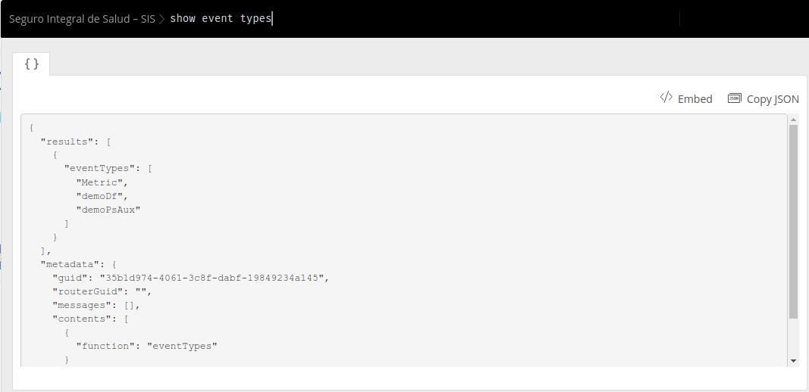
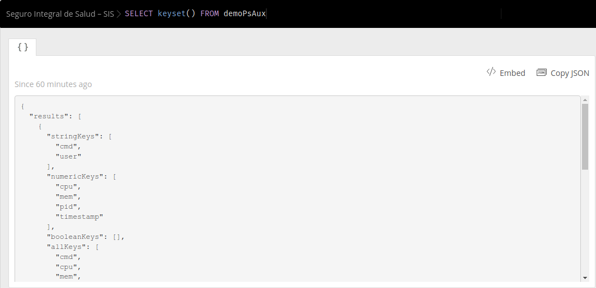
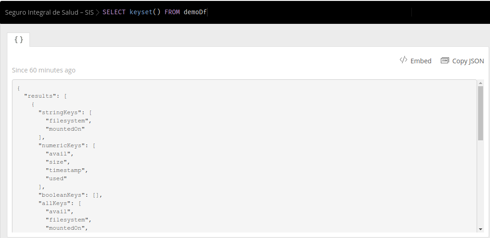
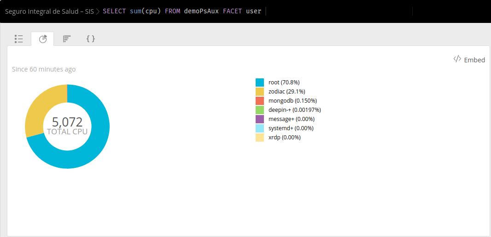

# New Relic Insights API - DEMO

Envía datos personalizados a New Relic Insights mendainte su API de inserciones (Insert API)

## 1. Ejemplos

Clona el repositorio

```
git clone git@github.com:softbutterfly/new-relic-insights-demo.git
cd new-relic-insights-demo
```

Antes de ejecutar los ejemplos, crea un archivo `.env` con la carpeta bash con el siguiente contentido.

```
# bash/.env
NEW_RELIC_INSIGHTS_KEY=<Tu llave del api New Relic Insights>
NEW_RELIC_ACCOUNT_ID=<EL ID de tu cuenta>
```

### A. Monitoreo de procesos con `ps aux`

1. Prueba el script task_ps_aux.sh

```
cd bash
for i in `seq 1 100`; do ./task_ps_aux.sh; sleep 10; done
```

Esto ejecutara nuestro script `task_ps_aux.sh` que recolecta las metricas arrojadas por el comando `ps aux` y las enviara a new relic cada 10 segundos.

2. Para ejecutarlo de forma permanente crea un cron job

```
crontab -e
```

Y escribe la siguiente instrución siguiente para ejecutar el script `task_ps_aux.sh` cada 5 minutos

```
*/5 * * * *  /path/to/task_ps_aux.sh
```

### B. Monitoreo de espacio con `df`

1. Prueba el script task_ps_aux.sh

```
cd bash
for i in `seq 1 100`; do ./task_df.sh; sleep 10; done
```

Esto ejecutara nuestro script `task_df.sh` que recolecta las metricas arrojadas por el comando `ps aux` y las enviara a new relic cada 10 segundos.

2. Para ejecutarlo de forma permanente crea un cron job

```
crontab -e
```

Y escribe la siguiente instrución siguiente para ejecutar el script `task_df.sh` cada 5 minutos

```
*/5 * * * *  /path/to/task_df.sh
```

## 2. Capturas de pantalla








